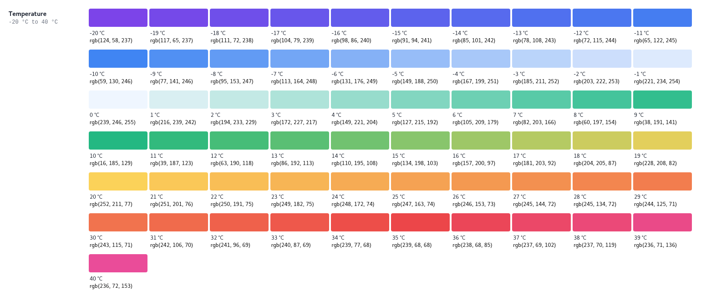

Weather Gradient
==================

Weather gradient is a small library allowing to determine the RGB color at a given value in an interval bounded by 
a combination of a minimum value and a color and a combination of a maximum value and a color.

In addition to the minimum and maximum limits, it is possible to add as many thresholds as desired.

[](https://github.com/ZHB/weather-gradient/actions/workflows/tests.yaml) [](https://codecov.io/gh/ZHB/weather-gradient)

<p align="center">
    
</p>

## Documentation

### Installation

Use [Composer](http://getcomposer.org/) to install Weather Gradient in your project :

```shell
composer require "zhb/weather-gradient"
```

### Usage

```php
$colors =  [
    0 => [59, 130, 246], // blue
    30 => [239, 68, 68], // red
];

// create a gradient from given thresholds
$gradient = Gradient::fromColors($colors);

// get the RGB color at a specific gradient position
$color = $gradient->colorAtGradientPosition(18);

// print the color
echo $color;

// or get r, g, b values
$r = $color->getR();
$g = $color->getG();
$b = $color->getB();
```

In addition to the Gradient class, you can use the Contrast::darkOrLight(array $rgb) to determine if a dark or light text fit the best with the given rgb color.

```php
// $bestColor will contain [255, 255, 255] (white)
$bestColor = Contrast::darkOrLight($darkBlue = [85, 101, 242]);

// $bestColor will contain [0, 0, 0] (black)
$bestColor = Contrast::darkOrLight($lightBlue = [59, 130, 246]);
```

### Examples

A usage example can be found in [example](./example) folder.
